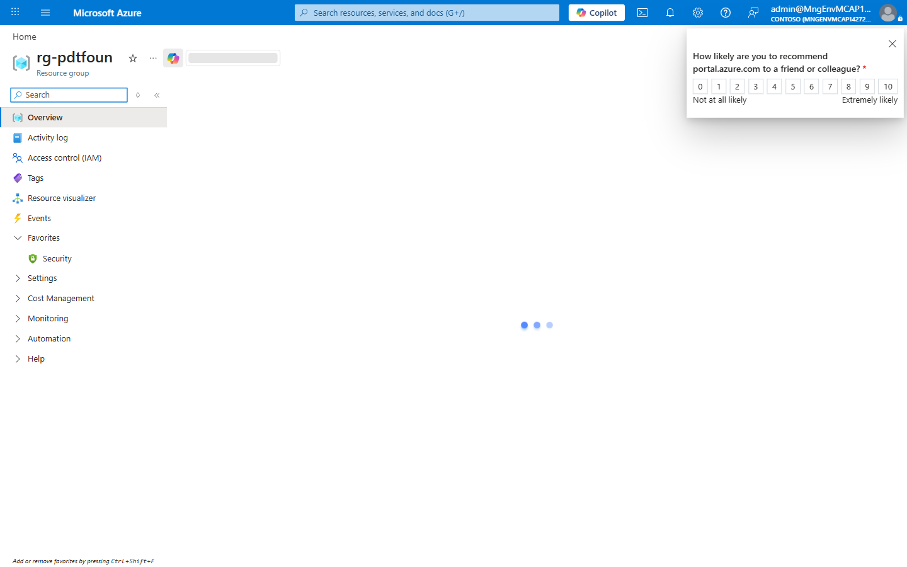
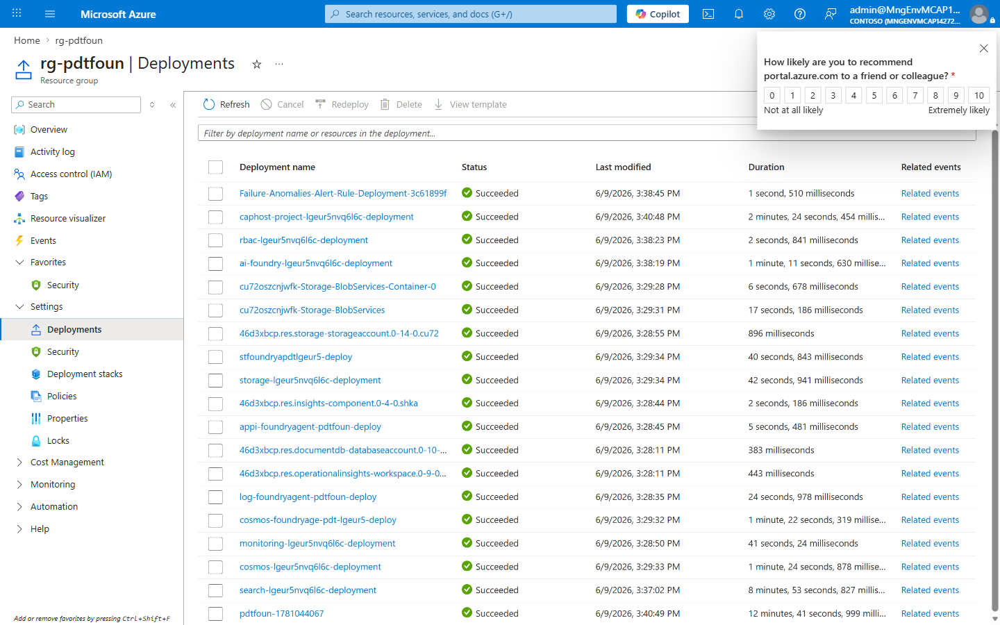
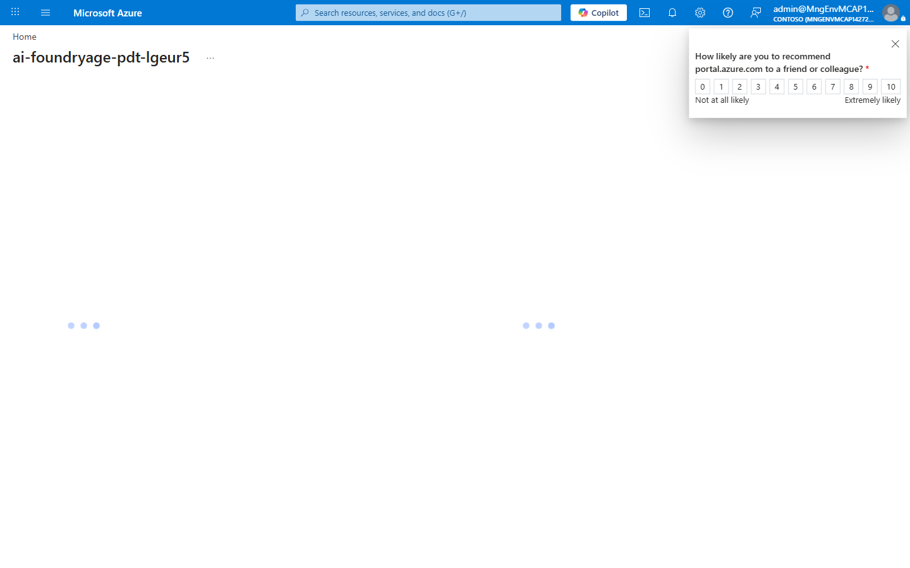
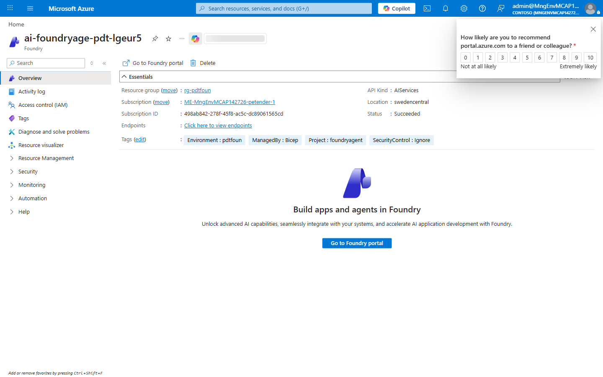
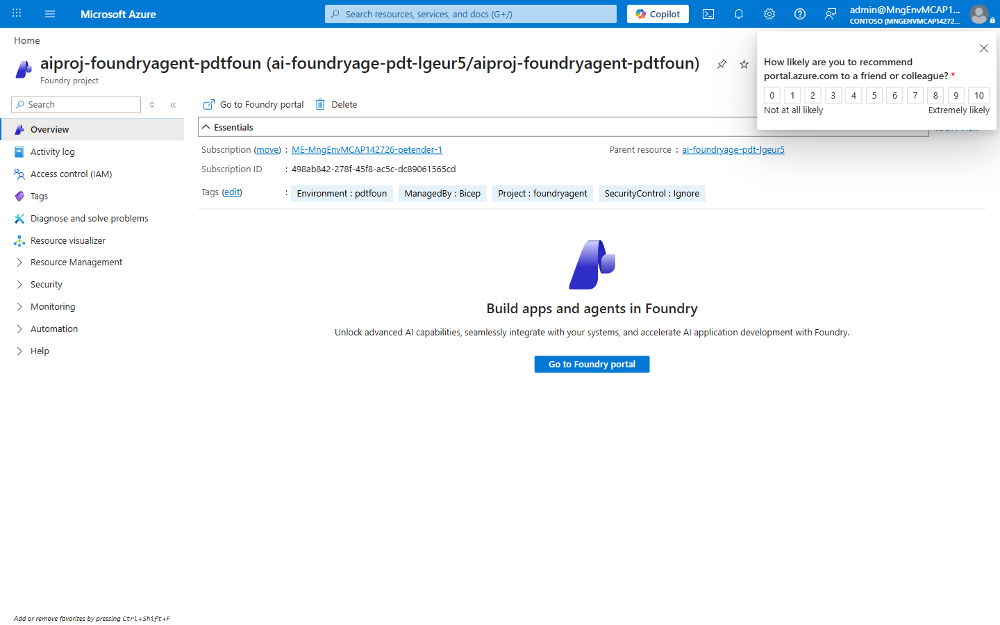

# Demo Guide - foundry-agentic-agent

📑 Demo Guide Contents

---

### foundry-agentic-agent - demo scenario

**Note:** Below demo steps should be used **as a guideline** for doing your own demos.

---

### 1. What Resources are getting deployed

This scenario deploys Azure AI Foundry Hub and Project with a model deployment and connected data services.
It showcases keyless managed identity integration for agent tools and storage/search/cosmos connectivity.

- rg-pdtfoun - Azure Resource Group.
- ai-foundryage-pdt-lgeur5 - AI Foundry account.
- aiproj-foundryagent-pdtfoun - AI Foundry project.
- gpt-4.1-mini - model deployment.
- cosmos-foundryage-pdt-lgeur5, stfoundryapdtlgeur5, search-foundryage-pdt-lgeur5.
- log-foundryagent-pdtfoun and appi-foundryagent-pdtfoun.

  

  

  

  

### 2. What can I demo from this scenario after deployment

Pre-demo checklist:

- PASS: `az group show --name rg-pdtfoun --output table`
- PASS: `az resource list --resource-group rg-pdtfoun --output table`
- PASS: `az cognitiveservices account show --name ai-foundryage-pdt-lgeur5 --resource-group rg-pdtfoun --query properties.provisioningState -o tsv`
- PASS: project endpoint from deployment summary is reachable.

Demo flow (Technical, 30 minutes):

1. (4 min) Show the resource group and explain Hub/Project split.
2. (5 min) Open AI Foundry account and model deployment details.
3. (5 min) Open Project connections to Cosmos, Storage, and AI Search.
4. (6 min) Run the Python agent locally and demonstrate multi-tool behavior.
5. (5 min) Show managed identity/RBAC role assignment design.
6. (5 min) Show monitoring signals in App Insights and Log Analytics.

Key endpoint:

- https://ai-foundryage-pdt-lgeur5.cognitiveservices.azure.com/api/projects/aiproj-foundryagent-pdtfoun

Contingency playbook:

- Agent tool call fails:
  - Diagnose: check project connection health and role assignments.
  - Recover: re-run RBAC assignment script and retry.
- Model invocation failure:
  - Diagnose: deployment status in model blade.
  - Recover: verify quota/model region and re-test with short prompt.
- Search/Cosmos issues:
  - Diagnose: service provisioning states and data plane RBAC.
  - Recover: reapply roles for project managed identity.

  

---

